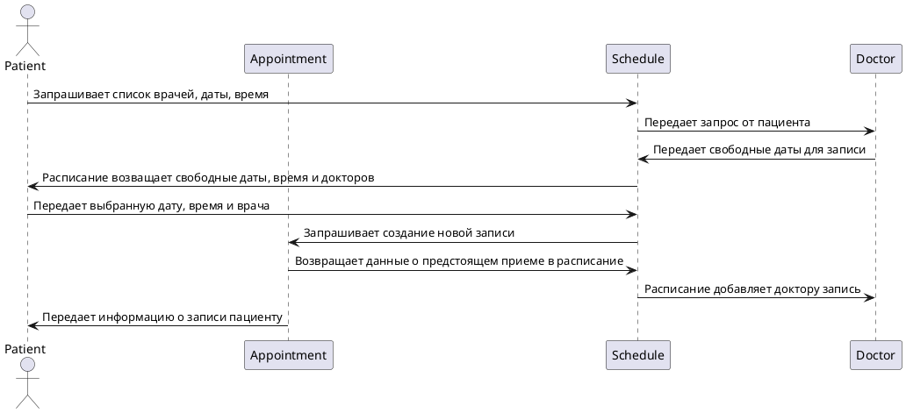

```plantuml
@startuml sequence_diagram_1

actor Patient
participant Appointment
participant Schedule
participant Doctor


Patient -> Schedule: Запрашивает список врачей, даты, время
Schedule -> Doctor: Передает запрос от пациента
Doctor -> Schedule: Передает свободные даты для записи
Schedule -> Patient: Расписание возващает свободные даты, время и докторов
Patient -> Schedule: Передает выбранную дату, время и врача
Schedule -> Appointment: Запрашивает создание новой записи
Appointment -> Schedule: Возвращает данные о предстоящем приеме в расписание
Schedule -> Doctor: Расписание добавляет доктору запись
Appointment -> Patient: Передает информацию о записи пациенту

@enduml
```
