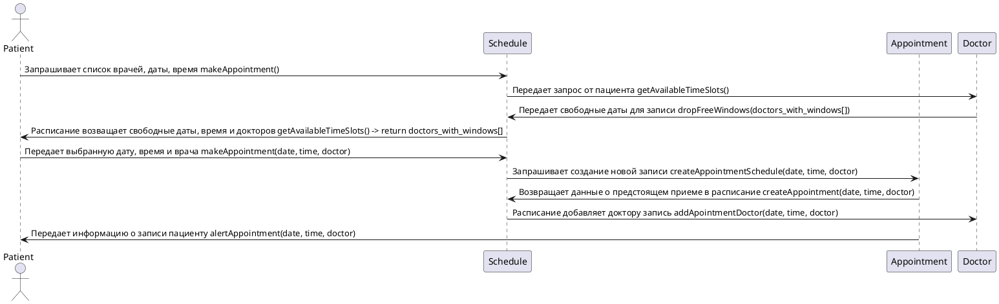

```plantuml
@startuml sequence_diagram_1

actor Patient
participant Schedule
participant Appointment
participant Doctor


Patient -> Schedule: Запрашивает список врачей, даты, время makeAppointment()
Schedule -> Doctor: Передает запрос от пациента getAvailableTimeSlots()
Doctor -> Schedule: Передает свободные даты для записи dropFreeWindows(doctors_with_windows[])
Schedule -> Patient: Расписание возващает свободные даты, время и докторов getAvailableTimeSlots() -> return doctors_with_windows[]
Patient -> Schedule: Передает выбранную дату, время и врача makeAppointment(date, time, doctor)
Schedule -> Appointment: Запрашивает создание новой записи createAppointmentSchedule(date, time, doctor)
Appointment -> Schedule: Возвращает данные о предстоящем приеме в расписание createAppointment(date, time, doctor)
Schedule -> Doctor: Расписание добавляет доктору запись addApointmentDoctor(date, time, doctor)
Appointment -> Patient: Передает информацию о записи пациенту alertAppointment(date, time, doctor)

@enduml

```
