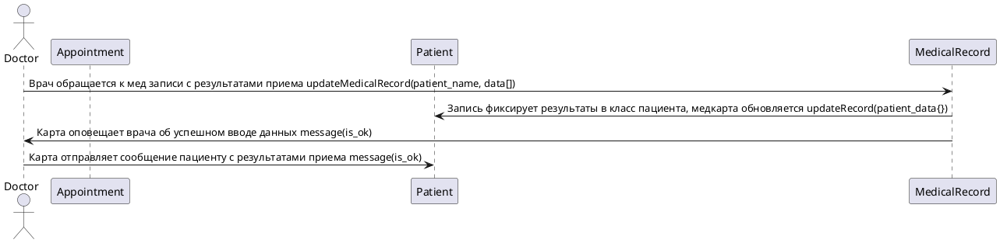

```plantuml
@startuml sequence_diagram_2

actor Doctor

participant Appointment
participant Patient
participant MedicalRecord


Doctor -> MedicalRecord: Врач обращается к мед записи с результатами приема updateMedicalRecord(patient_name, data[])
MedicalRecord -> Patient: Запись фиксирует результаты в класс пациента, медкарта обновляется updateRecord(patient_data{})
MedicalRecord -> Doctor: Карта оповещает врача об успешном вводе данных message(is_ok)
Doctor -> Patient: Карта отправляет сообщение пациенту с результатами приема message(is_ok)

@enduml
```
