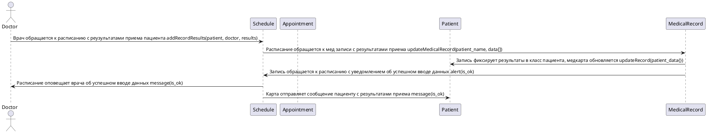

```plantuml
@startuml sequence_diagram_2

actor Doctor

participant Schedule
participant Appointment
participant Patient
participant MedicalRecord


Doctor -> Schedule: Врач обращается к расписанию с реузультатами приема пациента addRecordResults(patient, doctor, results)
Schedule -> MedicalRecord: Расписание обращается к мед записи с результатами приема updateMedicalRecord(patient_name, data[])
MedicalRecord -> Patient: Запись фиксирует результаты в класс пациента, медкарта обновляется updateRecord(patient_data{})
MedicalRecord -> Schedule: Запись обращается к расписанию с уведомлением об успешном вводе данных alert(is_ok)
Schedule -> Doctor: Расписание оповещает врача об успешном вводе данных message(is_ok)
Schedule -> Patient: Карта отправляет сообщение пациенту с результатами приема message(is_ok)

@enduml

```
