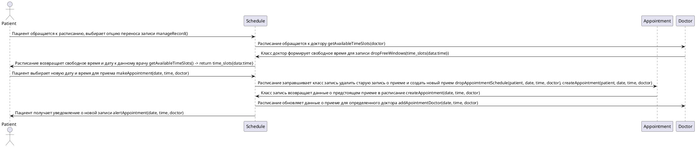

```plantuml
@startuml sequence_diagram_2

actor Patient

participant Patient
participant Schedule
participant Appointment
participant Doctor


Patient -> Schedule: Пациент обращается к расписанию, выбирает опцию переноса записи manageRecord()
Schedule -> Doctor: Расписание обращается к доктору getAvailableTimeSlots(doctor)
Doctor -> Schedule: Класс доктор формирует свободное время для записи dropFreeWindows(time_slots{data:time})
Schedule -> Patient: Расписание возвращает свободное время и дату к данному врачу getAvailableTimeSlots() -> return time_slots{data:time}
Patient -> Schedule: Пациент выбирает новую дату и время для приема makeAppointment(date, time, doctor)
Schedule -> Appointment: Расписание заправшивает класс запись удалить старую запись о приеме и создать новый прием dropAppoimtmentSchedule(patient, date, time, doctor), createAppointment(patient, date, time, doctor)
Appointment -> Schedule: Класс запись возвращает данные о предстоящем приеме в расписание createAppointment(date, time, doctor)
Schedule -> Doctor: Расписание обновляет данные о приеме для определенного доктора addApointmentDoctor(date, time, doctor)
Schedule -> Patient: Пациент получает уведомление о новой записи alertAppointment(date, time, doctor)

@enduml

```
