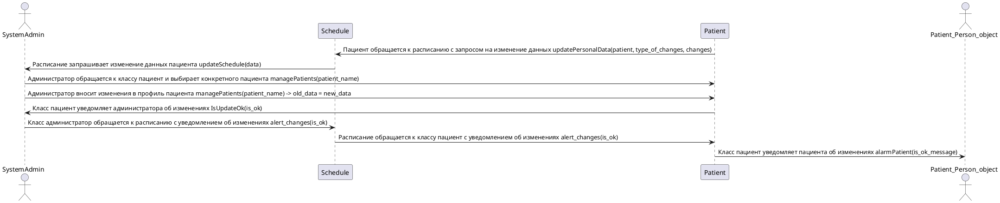

```plantuml
@startuml sequence_diagram_2

actor SystemAdmin

participant Schedule
participant Patient

actor Patient_Person_object

Patient -> Schedule: Пациент обращается к расписанию с запросом на изменение данных updatePersonalData(patient, type_of_changes, changes)
Schedule -> SystemAdmin: Расписание запрашивает изменение данных пациента updateSchedule(data)
SystemAdmin ->  Patient: Администратор обращается к классу пациент и выбирает конкретного пациента managePatients(patient_name)
SystemAdmin -> Patient: Администратор вносит изменения в профиль пациента managePatients(patient_name) -> old_data = new_data
Patient -> SystemAdmin: Класс пациент уведомляет администратора об изменениях IsUpdateOk(is_ok)
SystemAdmin -> Schedule: Класс администратор обращается к расписанию с уведомлением об изменениях alert_changes(is_ok)
Schedule -> Patient: Расписание обращается к классу пациент с уведомлением об изменениях alert_changes(is_ok)
Patient -> Patient_Person_object: Класс пациент уведомляет пациента об изменениях alarmPatient(is_ok_message)


@enduml

```
